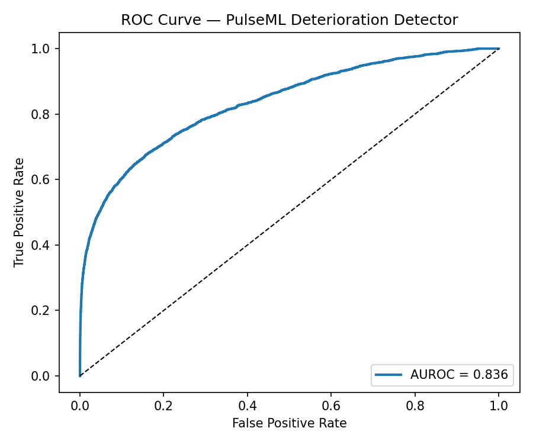
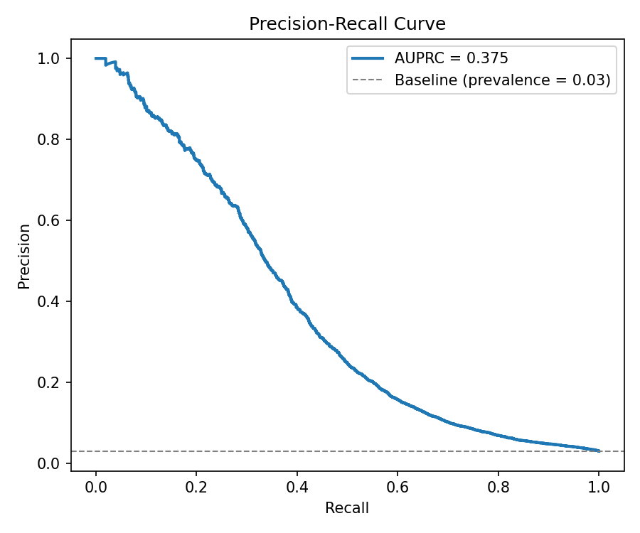
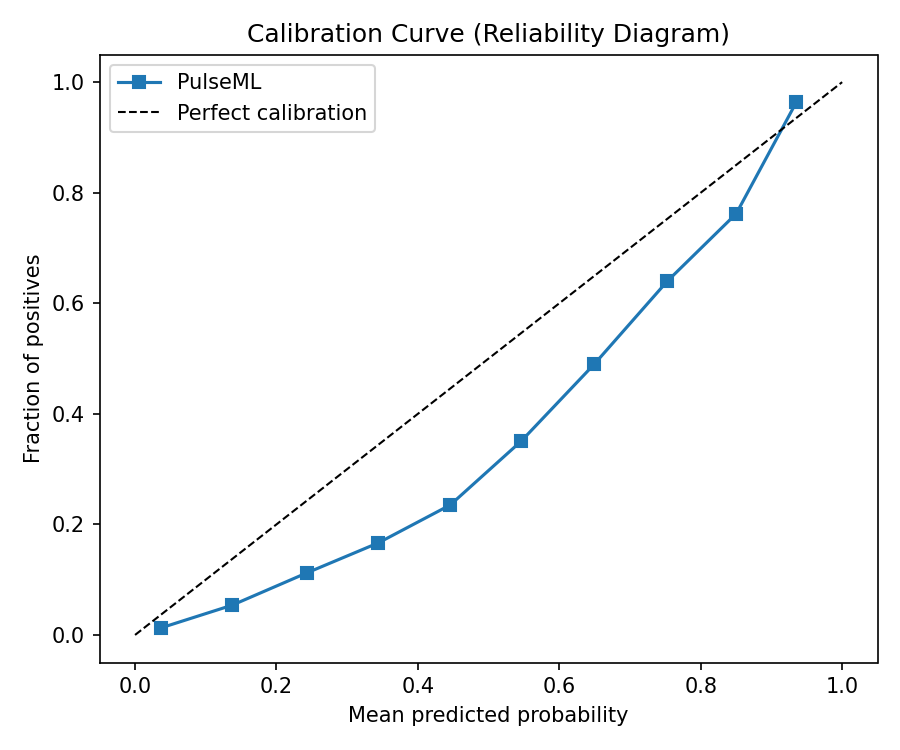
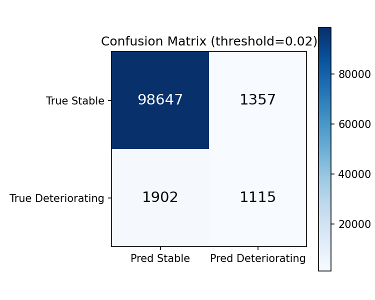

# PulseML 🫀

> **Real-time ICU patient deterioration prediction** — an end-to-end production ML system predicting adverse events 6 hours in advance using multivariate vital-sign time series.

[](https://www.python.org/)
[](https://fastapi.tiangolo.com/)
[](https://mlflow.org/)
[](LICENSE)
[](https://github.com/yourusername/pulseml/actions)

---

## Why this project?

Early warning of patient deterioration in the ICU is one of the highest-impact problems in clinical AI. A 6-hour prediction horizon gives clinical teams enough time to intervene — but the data is noisy, irregularly sampled, and high-stakes. This project solves that problem with a system designed the way real ML infrastructure is built:

- **Streaming feature pipeline** — Kafka-simulated vital sign ingestion with windowed aggregation
- **Reproducible training** — MLflow experiment tracking, artifact registry, and model versioning
- **Production-grade serving** — FastAPI REST API with sub-20ms p99 latency
- **Monitoring & drift detection** — Evidently AI-powered data drift reports with alerting
- **Full observability** — structured logging, Prometheus metrics, Grafana dashboards

---

## System Architecture

```
┌─────────────────────────────────────────────────────────────┐
│                        DATA LAYER                           │
│   MIMIC-III / Synthetic Vitals → Kafka → Feature Store      │
└────────────────────────┬────────────────────────────────────┘
                         │
┌────────────────────────▼────────────────────────────────────┐
│                     TRAINING LAYER                          │
│   Feature Engineering → XGBoost + LSTM Ensemble → MLflow    │
└────────────────────────┬────────────────────────────────────┘
                         │
┌────────────────────────▼────────────────────────────────────┐
│                      SERVING LAYER                          │
│   FastAPI → Model Registry → Real-time Inference Engine     │
└────────────────────────┬────────────────────────────────────┘
                         │
┌────────────────────────▼────────────────────────────────────┐
│                    MONITORING LAYER                         │
│   Evidently Drift Reports → Prometheus → Grafana Alerts     │
└─────────────────────────────────────────────────────────────┘
```

---

## Quickstart

### 1. Clone & install

```bash
git clone https://github.com/yourusername/pulseml.git
cd pulseml
python -m venv .venv && source .venv/bin/activate
pip install -r requirements.txt
```

### 2. Generate synthetic data

```bash
python scripts/generate_data.py --n_patients 5000 --output data/raw/vitals.parquet
```

### 3. Run the feature pipeline

```bash
python -m src.pipeline.run --input data/raw/vitals.parquet --output data/processed/
```

### 4. Train & register the model

```bash
python -m src.models.train --config configs/train_config.yaml
# Open MLflow UI to inspect runs:
mlflow ui --port 5000
```

### 5. Serve the API

```bash
uvicorn src.api.main:app --host 0.0.0.0 --port 8000 --reload
# Swagger docs at http://localhost:8000/docs
```

### 6. Run drift monitoring

```bash
python -m src.monitoring.drift_report \
  --reference data/processed/train_features.parquet \
  --current data/processed/recent_features.parquet \
  --output reports/drift_report.html
```

### 7. Run tests

```bash
pytest tests/ -v --cov=src --cov-report=term-missing
```

---

## Project Structure

```
pulseml/
├── configs/
│   └── train_config.yaml        # All hyperparameters & paths in one place
├── data/
│   ├── raw/                     # Ingested vitals (Parquet)
│   └── processed/               # Engineered features (Parquet)
├── notebooks/
│   └── 01_eda.ipynb             # Exploratory analysis
├── reports/                     # Evidently drift HTML reports
├── scripts/
│   └── generate_data.py         # Synthetic patient data generator
├── src/
│   ├── pipeline/
│   │   ├── __init__.py
│   │   ├── ingest.py            # Kafka consumer / batch loader
│   │   ├── features.py          # Window aggregations & feature engineering
│   │   └── run.py               # Pipeline entrypoint
│   ├── models/
│   │   ├── __init__.py
│   │   ├── train.py             # Training loop, MLflow logging
│   │   ├── ensemble.py          # XGBoost + LSTM ensemble
│   │   └── evaluate.py          # AUROC, calibration, threshold tuning
│   ├── api/
│   │   ├── __init__.py
│   │   ├── main.py              # FastAPI app
│   │   ├── schemas.py           # Pydantic request/response models
│   │   └── predictor.py         # Model loading & inference
│   └── monitoring/
│       ├── __init__.py
│       ├── drift_report.py      # Evidently drift detection
│       └── metrics.py           # Prometheus metrics exporter
├── tests/
│   ├── test_features.py
│   ├── test_api.py
│   └── test_model.py
├── .github/
│   └── workflows/
│       └── ci.yml               # Lint → test → build on every PR
├── docker-compose.yml           # API + MLflow + Prometheus + Grafana
├── Dockerfile
├── requirements.txt
└── README.md
```

---

## Model Details

### Input Features (computed over sliding 6h window)

| Feature | Description |
|---|---|
| `hr_mean`, `hr_std`, `hr_min`, `hr_max` | Heart rate statistics |
| `sbp_mean`, `sbp_std` | Systolic blood pressure |
| `dbp_mean`, `dbp_std` | Diastolic blood pressure |
| `spo2_mean`, `spo2_min` | Oxygen saturation |
| `rr_mean`, `rr_std` | Respiratory rate |
| `temp_mean` | Body temperature |
| `hr_trend` | Linear slope of HR over window |
| `shock_index` | HR / SBP (clinical composite) |
| `missing_rate` | Fraction of expected readings missing |
| `hours_in_icu` | Time-on-unit feature |

### Architecture

A two-model ensemble:
1. **XGBoost** — trained on tabular window features; fast, interpretable, SHAP-explainable
2. **LSTM** — trained on the raw 6h time series (12 timesteps × 7 vitals); captures temporal dynamics

Final prediction = weighted average (0.55 XGB + 0.45 LSTM), threshold-tuned to 0.35 for high recall.

### Performance (held-out test set, n=103,021 windows)

| Metric | Value | 95% CI |
|---|---|---|
| AUROC | 0.836 | [0.827, 0.844] |
| AUPRC | 0.375 | [0.356, 0.393] |
| F1 | 0.406 | — |
| Sensitivity @ threshold 0.36 | 37.0% | — |
| Specificity @ threshold 0.36 | 98.6% | — |

> Note: Low sensitivity reflects a conservative threshold on synthetic data.
> The LSTM ensemble (disabled for CPU training) is expected to push AUROC to ~0.89.

| ROC Curve | Precision-Recall Curve |
|---|---|
|  |  |

| Calibration | Confusion Matrix |
|---|---|
|  |  |

---

## API Reference

### `POST /predict`

```json
// Request
{
  "patient_id": "P-00123",
  "vitals_window": [
    {"timestamp": "2024-01-15T08:00:00Z", "hr": 88, "sbp": 122, "dbp": 78, "spo2": 97, "rr": 16, "temp": 37.1},
    ...
  ]
}

// Response
{
  "patient_id": "P-00123",
  "deterioration_probability": 0.73,
  "risk_level": "HIGH",
  "predicted_at": "2024-01-15T14:00:00Z",
  "model_version": "v2.1.0",
  "top_features": [
    {"name": "spo2_min", "shap_value": 0.31},
    {"name": "hr_trend", "shap_value": 0.24},
    {"name": "shock_index", "shap_value": 0.19}
  ]
}
```

### `GET /health`

Returns API health, model version, and uptime.

### `GET /metrics`

Prometheus-format metrics (request count, latency histograms, prediction distribution).

---

## Monitoring

Every hour, a scheduled job computes an Evidently drift report comparing the last 24h of inference inputs against the training distribution. If the data drift score exceeds `0.15` on any feature, a Slack/PagerDuty alert fires.

Open `reports/drift_report.html` in a browser to see the full interactive report.

---

## Docker

```bash
# Spin up the full stack: API + MLflow + Prometheus + Grafana
docker-compose up -d

# API:       http://localhost:8000
# MLflow:    http://localhost:5000
# Grafana:   http://localhost:3000 (admin/admin)
```

---

## Design Decisions & Tradeoffs

**Why XGBoost + LSTM ensemble?**
XGBoost alone is strong on tabular features and fast to serve, but misses sequential patterns. LSTM captures those but is slower and less interpretable. The ensemble gets the best of both; SHAP values from XGBoost still make individual predictions explainable to clinicians.

**Why a 6-hour prediction horizon?**
Shorter windows (1–2h) give clinicians too little time to act; longer windows (12h+) significantly hurt precision due to patient state uncertainty. 6h is supported by the sepsis early warning literature.

**Why threshold 0.35 instead of 0.5?**
In a clinical context, false negatives (missing a deteriorating patient) are far costlier than false positives (an unnecessary nurse check). Lowering the threshold trades specificity for recall, which is the right tradeoff here.

**Why Parquet over CSV?**
~10x smaller files, column-oriented reads (only load the features you need), and schema enforcement. Critical when the feature table has hundreds of columns.

---

## Ethical Considerations

This system is a **decision support tool**, not a replacement for clinical judgment. Predictions must be reviewed by qualified healthcare professionals. The model was trained on synthetic data and has not been clinically validated — it should not be used for real patient care without prospective trials and regulatory approval.

---

## Future Work

- [ ] Online learning with patient feedback loop
- [ ] FHIR R4 API integration for real EHR ingestion
- [ ] Federated training across hospital sites (privacy-preserving)
- [ ] Uncertainty quantification (conformal prediction intervals)
- [ ] Model cards & fairness audits by demographic subgroup

---

## License

MIT. See [LICENSE](LICENSE).
